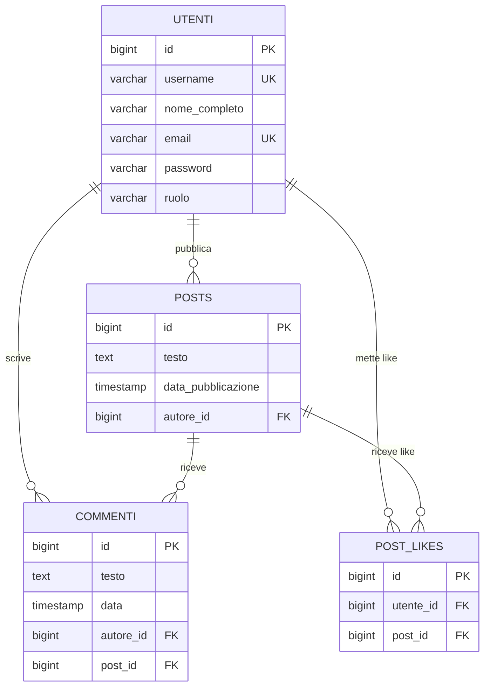

# SocialNetwork — Progetto S3/L5

Applicazione Spring Boot per la gestione di un semplice social network con autenticazione JWT e autorizzazione basata su ruoli.

## Tecnologie

- Java 25
- Spring Boot 4.1.0
- Spring Security + BCrypt
- JWT (jjwt 0.12.6)
- Spring Data JPA / Hibernate
- PostgreSQL
- Lombok

## Struttura del progetto

```
src/main/java/com/SocialNetwork/SocialNetwork/
├── controller/     # Endpoint REST
├── dto/            # Oggetti di richiesta/risposta
├── exception/      # Eccezioni custom + GlobalExceptionHandler
├── model/          # Entità JPA (Utente, Post, Like, Commento, Role)
├── repository/     # Interfacce Spring Data JPA
├── runner/         # DataInitializer (dati di test)
├── security/       # JwtUtil, JwtFilter, SecurityConfig
└── service/        # Logica di business
```

## Avvio

In `src/main/resources/application.properties` verificare:

```properties
spring.datasource.url=jdbc:postgresql://localhost:5432/socialnetwork
spring.datasource.username=postgres
spring.datasource.password=TUA_PASSWORD
spring.jpa.hibernate.ddl-auto=create
```

Il database `socialnetwork` deve esistere su PostgreSQL prima del primo avvio.  
Le tabelle vengono generate automaticamente da Hibernate.

All'avvio il `DataInitializer` crea automaticamente 3 utenti di test:

| Username | Password | Ruolo |
|---|---|---|
| mario_rossi | password123 | MODERATOR |
| giulia_bianchi | password123 | MEMBER |
| luca_verdi | password123 | MEMBER |

---

## API Endpoints

### Autenticazione (`/auth`)

| Metodo | URL | Auth | Descrizione |
|--------|-----|------|-------------|
| POST | `/auth/register` | Pubblica | Registra un nuovo utente |
| POST | `/auth/login` | Pubblica | Login, restituisce token JWT |

### Utenti (`/utenti`)

| Metodo | URL | Auth | Descrizione |
|--------|-----|------|-------------|
| PATCH | `/utenti/{id}/ruolo` | Solo MODERATOR | Cambia il ruolo di un utente |

### Post (`/posts`)

| Metodo | URL | Auth | Descrizione |
|--------|-----|------|-------------|
| GET | `/posts` | Pubblica | Restituisce tutti i post |
| GET | `/posts/{id}` | Pubblica | Restituisce un post per ID |
| POST | `/posts` | Autenticato | Crea un nuovo post |
| PUT | `/posts/{id}` | Solo autore | Aggiorna il testo di un post |

### Like (`/posts/{postId}/likes`)

| Metodo | URL | Auth | Descrizione |
|--------|-----|------|-------------|
| POST | `/posts/{postId}/likes` | Autenticato | Aggiunge un like a un post |
| DELETE | `/posts/{postId}/likes` | Autenticato | Rimuove il proprio like da un post |

### Come usare il token JWT

Dopo il login, includere il token in ogni richiesta protetta come header:

```
Authorization: Bearer <token>
```

---

## Regole di autorizzazione

La slide richiede di documentare per ogni operazione protetta quale regola di autorizzazione è stata scelta e perché.

### POST `/auth/register` — Pubblica
Chiunque può registrarsi. Nessuna autorizzazione richiesta: è il punto di ingresso del sistema.

### POST `/auth/login` — Pubblica
Chiunque può fare login con username e password. Nessuna autorizzazione richiesta.

### PATCH `/utenti/{id}/ruolo` — Solo MODERATOR (basato sul ruolo)
Solo un utente con ruolo `MODERATOR` può cambiare il ruolo di un altro utente.  
**Motivazione**: cambiare il ruolo è un'operazione amministrativa che può elevare i privilegi di un account. Affidarla solo ai moderatori impedisce che un semplice `MEMBER` si auto-promuova o promuova altri.

### POST `/posts` — Autenticato (qualsiasi ruolo)
Qualsiasi utente autenticato (MEMBER o MODERATOR) può creare un post.  
**Motivazione**: la pubblicazione di contenuti è la funzione principale del social network e non richiede privilegi speciali, basta essere registrati.

### GET `/posts`, GET `/posts/{id}` — Pubblica
La lettura dei post è pubblica, senza autenticazione.  
**Motivazione**: i contenuti del social network sono visibili a tutti. Richiedere l'autenticazione anche per la lettura ridurrebbe l'accessibilità senza un reale beneficio di sicurezza.

### PUT `/posts/{id}` — Solo l'autore (basato sulla proprietà della risorsa)
Solo l'utente che ha creato il post può modificarlo.  
**Motivazione**: un post è una risorsa personale. Permettere a chiunque di modificare i post altrui violerebbe l'integrità dei contenuti. Si è scelto il controllo sulla proprietà (ownership) anziché sul ruolo, perché anche un moderatore non dovrebbe poter alterare le parole degli altri utenti.

### POST `/posts/{postId}/likes` — Autenticato (qualsiasi ruolo)
Qualsiasi utente autenticato può mettere like a un post. Un utente non può mettere più di un like allo stesso post (controllo a livello di service e unique constraint nel DB).  
**Motivazione**: il like è un'interazione sociale base, disponibile a tutti gli utenti registrati.

### DELETE `/posts/{postId}/likes` — Autenticato, solo chi ha messo il like (basato sulla proprietà)
Il sistema rimuove il like dell'utente autenticato per quel post. Non è necessario conoscere l'ID del like: basta essere l'utente che lo ha messo.  
**Motivazione**: un utente può rimuovere solo il proprio like, non quello degli altri. La rimozione è identificata dalla coppia (utente corrente, post) invece che dall'ID del like, per un'API più intuitiva.

---

## Schema ER aggiornato



---

## Note implementative

**BCrypt**: le password vengono salvate nel database come hash BCrypt. Non vengono mai salvate o restituite in chiaro. Il campo `password` è annotato con `@JsonProperty(access = WRITE_ONLY)` per escluderlo dalle risposte JSON.

**JWT stateless**: il server non mantiene sessioni. Ogni richiesta include il token JWT nell'header `Authorization`. Il token ha validità 24 ore.

**Ruoli**: al momento della registrazione ogni utente riceve automaticamente il ruolo `MEMBER`. Solo un `MODERATOR` può promuovere un utente a `MODERATOR` tramite l'endpoint dedicato.

**Like unico**: il vincolo di unicità sulla coppia `(utente_id, post_id)` è garantito sia a livello di database (`@UniqueConstraint`) sia a livello di service, per una gestione corretta degli errori con messaggio leggibile.

**Cascata eliminazione**: `UtenteService.delete()` gestisce manualmente la rimozione in ordine corretto (like → commenti → post → utente) per rispettare i vincoli di FK di PostgreSQL.
