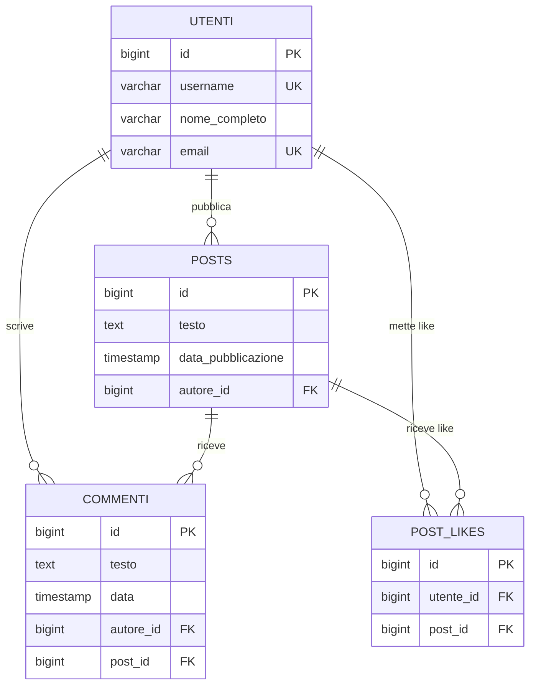

# SocialNetwork

Applicazione Spring Boot per la gestione di un semplice social network.

## Tecnologie

- Java 25
- Spring Boot 4.1.0
- Spring Data JPA / Hibernate
- PostgreSQL 18
- Lombok

## Struttura del progetto

```
src/main/java/com/SocialNetwork/SocialNetwork/
├── model/          # Entità JPA
├── repository/     # Interfacce Spring Data JPA
├── service/        # Logica di business
└── runner/         # CommandLineRunner per popolamento e test
```

## Entità e relazioni

### Utente
Identificato da `username` (univoco), `nomeCompleto` ed `email` (univoca).  
Nessuna collezione bidirezionale sull'entità: le liste di post, commenti e like
dell'utente si recuperano tramite query sui repository dedicati, mantenendo
l'entità leggera e senza rischi di caricamento ricorsivo.

### Post
Contiene `testo` (TEXT) e `dataPubblicazione` (LocalDateTime).

**Relazione con Utente → `@ManyToOne`**  
Ogni post ha un solo autore, ma un utente può pubblicare molti post.  
Scelta: la FK `autore_id` risiede nella tabella `posts` — è la parte "molti"
della relazione e tiene il riferimento all'utente che ha pubblicato.

### Commento
Contiene `testo` (TEXT) e `data` (LocalDateTime).

**Relazione con Post → `@ManyToOne`**  
Un commento appartiene a un solo post, un post può avere molti commenti.  
FK `post_id` nella tabella `commenti`.

**Relazione con Utente → `@ManyToOne`**  
Ogni commento ha un autore. FK `autore_id` nella tabella `commenti`.  
Scelta: due FK separate su `commenti` invece di una relazione ternaria,
perché autore e post sono concetti indipendenti e questa struttura
semplifica le query.

### Like (tabella: `post_likes`)
**Relazione con Utente e Post → doppio `@ManyToOne`**  
Un like collega un utente a un post. Si è scelto di modellarlo come entità
separata (e non come `@ManyToMany` tra Utente e Post) per poter aggiungere
un `@UniqueConstraint` esplicito sulla coppia `(utente_id, post_id)` a
livello di database, garantendo l'unicità del like anche in caso di
accessi concorrenti.

Il vincolo di unicità è rafforzato anche a livello di service tramite
controllo con Stream prima del salvataggio.

> Il nome della tabella è `post_likes` invece di `likes` perché
> `LIKE` è una parola riservata in SQL.

## Schema ER



## Configurazione

In `src/main/resources/application.properties` impostare:

```properties
spring.datasource.url=jdbc:postgresql://localhost:5432/socialnetwork
spring.datasource.username=postgres
spring.datasource.password=TUA_PASSWORD
spring.jpa.hibernate.ddl-auto=create
```

Il database `socialnetwork` deve essere creato manualmente su PostgreSQL
prima del primo avvio. Le tabelle vengono generate automaticamente da
Hibernate all'avvio dell'applicazione.

## NOTA IMPORTANTE

Ho usato JPA per generare le tabelle/relazioni/progressivi etc.
Mi sembrava più pratico e con meno margine di errore 
ed era specificato di usare JPA quindi non vedevo il senso di fare gli script manuali come in precedenti esercizi...

[EXTRA] gestione eliminazione utente con dati associati

Ho aggiunto il metodo delete a UtenteService per provare ad eliminare un utente con likes e post e ho capito il problema:
se provi a eliminare un utente che ha post, commenti o like nel db, PostgreSQL
ti tira un errore di foreign key constraint .non puoi cancellare un record
padre se ci sono ancora record figli collegati.

non bisogna fare deleteById sull'utente, bisogna
prima eliminare manualmente tutte le dipendenze nell'ordine giusto:
1. like messi dall'utente su post altrui
2. commenti scritti dall'utente su post altrui
3. like e commenti ricevuti sui suoi post
4. i suoi post
5. infine l'utente

Ho aggiunto anche findByUtente su LikeRepository e findByAutore su
CommentoRepository per supportare queste query.
